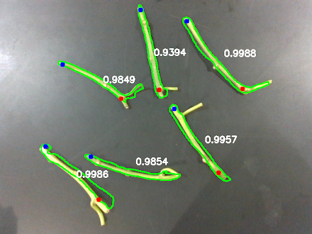
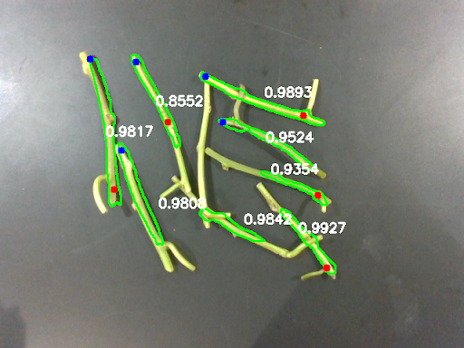
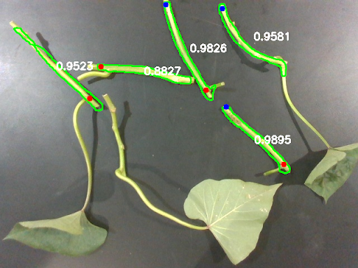
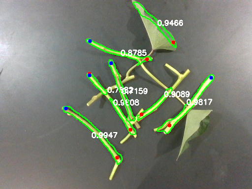
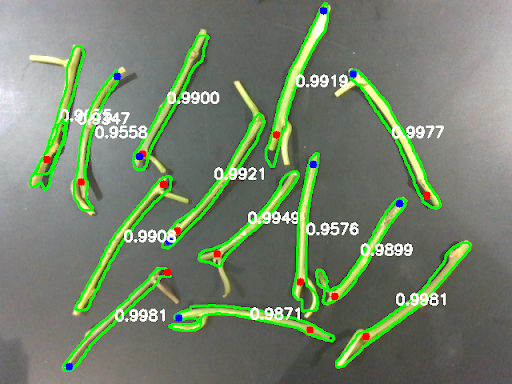
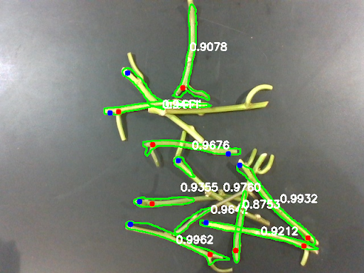
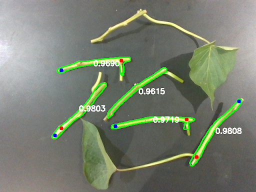
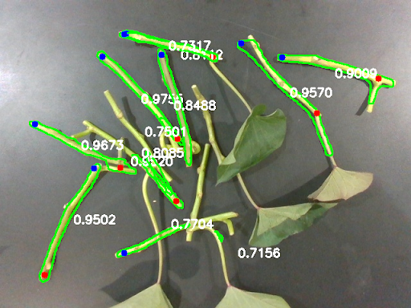

### How to run the code?

We are using pytorch and torchvision's built-in implementations of deep learning models. 
The version of some of the main packages in our code environemnt is as below.

```bash
python 3.8.10
pytorch 2.0.0+nv23.05
torchvision 0.15.2a0
```
Before running any file, please set the appropiate path to the dataset and result folders.

### Train

```bash
python train_fast.py
```

### Evaluation
To evaluate the model with a particular trained weights
```bash
python validate.py
```
To evaluate the model with trained weights in all epoches
```bash
python validate_all.py
```
### Inference over a single image
```bash
python single_image_prediction.py
```

### Validation dataset
Included with this repository.
```bash
https://github.com/NCSU-BAE-ARLab/Sweetpotato_transplanting/tree/main/validation_data
```
### Qualitative results
<table>
  <tr>
    <th colspan="2">Without Leaf</th>
    <th colspan="2">With Leaf</th>
  </tr>
  <tr>
    <th>No Overlap</th>
    <th>Overlap</th>
    <th>No Overlap</th>
    <th>Overlap</th>
  </tr>
  <tr>
    <td></td>
    <td></td>
    <td></td>
    <td></td>
  </tr>
  <tr>
    <td></td>
    <td></td>
    <td></td>
    <td></td>
  </tr>
</table>
